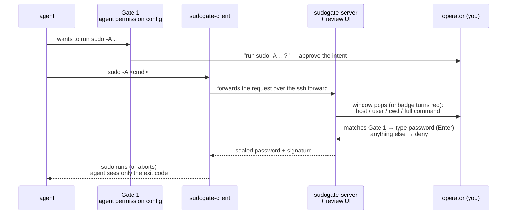
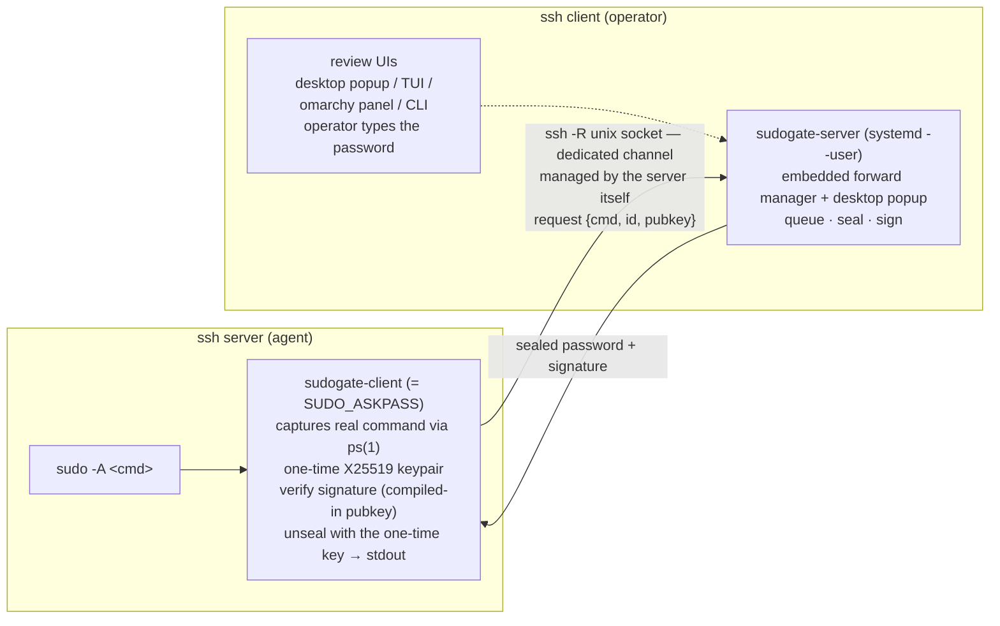

# SudoGate

**Reverse askpass** — sudo password prompts from AI agents on ssh servers, delivered to the machine you're sitting at.

[](https://github.com/tomasWade/sudogate/actions/workflows/test.yml)
[English](README.md) · [简体中文](README.zh-CN.md)

## Why

Running a coding agent (opencode, Claude Code, codex, ...) on an ssh server means it
will eventually need `sudo`. The usual options are all bad:

- **`NOPASSWD` sudoers** — every piece of code the agent runs now holds root
- **Pasting the password into chat** — it lands in the model context and transcripts
- **Forwarding a GUI dialog** — needs a forwarded display, useless on headless boxes

SudoGate takes another route: the agent runs plain `sudo -A`, and the password
prompt travels back **through a dedicated ssh forward** to your machine. Every
elevation is read and approved by a human; the password is typed fresh each
time and never stored on either machine.

What that looks like on the operator's desktop — the agent ran `sudo -A id`
on the ssh server, and this window popped by itself:


## Features

Ways you use it:

- **Desktop popup** — a request pops a floating window in your face; when the
  queue drains (approved / denied / timed out / withdrawn) the window closes
  itself. Enable with one command: `sudogate-server popup on`
- **Review from any surface** — desktop popup, terminal TUI, omarchy panel,
  or plain CLI; all backed by one server, decisions are first-come-first-served
- **Live queue** — per-request countdowns, per-host forward health lights,
  instant updates (fsnotify, zero polling); Ctrl+C on the agent side
  withdraws its review immediately
- **Audit trail** — every decision (approved / denied / timeout / cancelled /
  shutdown) logged as JSONL

Security model:

- Human in the loop, per command — one review per elevation; deny stops it instantly
- Zero password persistence — typed fresh each time, nothing at rest on either end
- No new trust surface — transport is an ssh `-R` unix-socket forward; authentication
  and encryption come from ssh itself. No ports, no certificates
- Compile-time key split — server binary embeds the private key, client binary embeds
  the public key; the codebase has no key-generation path
- Tamper-proof by construction — per-request X25519 sealing, Ed25519 signatures,
  one-time ids and command-hash binding
- Disconnected = denied — with the ssh-client machine (where the server runs) off
  or unreachable, the forward dies with it and remote `sudo -A` simply fails
- Pairs with your agent's own gate — e.g. opencode's `"*sudo*": "ask"` rule,
  giving two independent approvals per command

## Quick Start

Three roles: the **build machine** (repo + keys, runs `make`), the **ssh client**
(your machine, runs sudogate-server and the review UI), the **ssh server**
(the machine agents run on, gets sudogate-client). Usually the first two are
the same box. Building needs Go ≥ 1.24, make, openssl. `<ssh-server>` below
means `user@host` or its ssh-config alias.

**1. Keypair, once** (any third-party tool; out of band — the repo never
stores keys, every build machine needs the same pair):

```bash
mkdir -p keys
openssl genpkey -algorithm ed25519 -out keys/laptop.key
openssl pkey -in keys/laptop.key -pubout -out keys/laptop.pub
```

**2. ssh client** — server + service (+ optional review surfaces):

```bash
make install-server    # build + ~/.local/bin + systemd --user service
make install-plugin    # omarchy review panel (optional, recommended)
sudogate-server popup on   # desktop popup (optional; see Review UIs)
```

**3. Forward channel**, once per ssh server (target must accept passwordless
BatchMode ssh):

```bash
make install-forward HOST=<ssh-server>
# remote uid ≠ 1000? override the socket path:
# make install-forward HOST=nuc:/run/user/1001/sudogate.sock
```

**4. ssh server** — copy the client over (static Go binary, zero deps;
traditional sudo required — sudo-rs has no askpass):

```bash
ssh <ssh-server> 'mkdir -p ~/.local/bin'
scp build/sudogate-client <ssh-server>:.local/bin/
echo 'export SUDO_ASKPASS=$HOME/.local/bin/sudogate-client' | ssh <ssh-server> 'cat >> ~/.profile'
```

<details>
<summary><b>Alternative routes</b> — build on the ssh server · agent (non-interactive) environment</summary>

```bash
# Build-on-the-server route: clone the repo on the ssh server, place the same
# keypair in keys/, then make (inject needs the private key present — don't
# take the private key to more machines than necessary)
make install-client
```

The `~/.profile` export covers interactive shells. Agent shells are
non-interactive and read **no rc files** — for the variable to reach the
agent process environment, see [Working with agents](#working-with-agents).

</details>

**5. One-time sshd config on the ssh server (root)**: sshd leaves the socket
file behind when a connection ends (even a clean exit) and the stale file
blocks forward re-establishment. Make each new connection unlink it before
binding — the server's embedded forward relies on this for reliable self-heal:

```bash
echo 'StreamLocalBindUnlink yes' | sudo tee /etc/ssh/sshd_config.d/99-sudogate.conf
sudo systemctl restart ssh    # Debian/Ubuntu; other distros may call it sshd
```

**6. Verify end to end** on the ssh server:

```bash
sudogate-client test   # a review request pops up on the ssh client
sudo -A <command>      # the real thing
```


<details>
<summary><b>How the forward channel works</b> — and why <code>~/.ssh/config</code> must stay clean</summary>

Forwards are managed **inside the server** (`~/.config/sudogate/forward.conf`,
one host per line): each target runs as a supervised `ssh -N -R` child
process — alive whether or not you have an interactive session, restarted
with backoff on failure, reaped when the server exits. Inspect at any time:

```bash
sudogate-server forward list     # per-host ✓/✗, restart count, last error
```

**Do not** put `RemoteForward` in `~/.ssh/config` for the target host. Any
short-lived ssh that matches such a block (health probes from workspace
tools, one-off `ssh host 'cmd'` runs, reconnecting mounts) will steal the
socket path, die seconds later, and leave a corpse file that remote `sudo -A`
reads as `connection refused` — even while a perfectly healthy forward
listener exists namelessly beside it. With `StreamLocalBindUnlink yes` this
happens unconditionally on every matching connection — see
[When a tool such as herdr runs the ssh for you](#when-a-tool-such-as-herdr-runs-the-ssh-for-you)
for the full anatomy.

</details>

## Worked example (laptop → minipc)

Real names now: `laptop` doubles as build machine and ssh client; `minipc` is
the ssh server (IP 192.168.1.50, uid 1000). From zero to the first prompt:

```bash
# laptop: generate the keypair, make install-server (see above), then ship the client
ssh minipc 'mkdir -p ~/.local/bin'
scp build/sudogate-client minipc:.local/bin/
```

```bash
# minipc: export the askpass (interactive shell)
echo 'export SUDO_ASKPASS=$HOME/.local/bin/sudogate-client' >> ~/.profile
```

```bash
# minipc (root, once): let new sessions clear a stale socket
echo 'StreamLocalBindUnlink yes' | sudo tee /etc/ssh/sshd_config.d/99-sudogate.conf
sudo systemctl restart ssh
```

```bash
# laptop: add the forward target to the server (hot; passwordless ssh
# must already work)
make install-forward HOST=minipc
```

Once connected, inside the session on minipc:

```bash
sudogate-client test    # self test: a “sudogate-client self-test” review
                        # pops up on laptop — the bridge works
sudo -A whoami          # for real: read the command → type password → root
```

## Working with agents

SudoGate is the **second** of two gates. The first lives in your agent's own
permission config; together they give every elevation two independent human
approvals.

**Gate 1 — the agent asks before running sudo.** For opencode:

```jsonc
// ~/.config/opencode/opencode.json
{
  "permission": {
    "bash": {
      "*sudo*": "ask"
    }
  }
}
```

Claude Code and codex have equivalents; anything that can require human
confirmation for `sudo` commands works as Gate 1.

**Gate 2 — SudoGate asks before the password travels.** The full flow:



The review discipline that makes phishing hard: **approve only requests whose
command matches what Gate 1 just approved**. A command you never sanctioned,
a host you have no session into — deny.

**Wiring the agent's environment.** `sudo` reads `SUDO_ASKPASS` from its own
environment, inherited from the agent process. Agent shells are
non-interactive: they read **no rc files**, so the `~/.profile` export from
Quick Start only covers interactive sessions. The variable has to be in the
agent process environment:

- Agent started from an interactive shell — it inherits that shell's
  environment. Put the export **before** the interactivity guard in
  `~/.bashrc` (or in `~/.zshenv` for zsh) so every child gets it:

  ```bash
  # first line of ~/.bashrc — BEFORE the "case $- in *i*)" guard
  export SUDO_ASKPASS=$HOME/.local/bin/sudogate-client
  ```

- Agent started by systemd (or any supervisor) — set it in the unit:

  ```ini
  [Service]
  Environment=SUDO_ASKPASS=%h/.local/bin/sudogate-client
  ```

Verify from the agent's own shell tool:

```bash
echo "${SUDO_ASKPASS:-MISSING}"
```

**What the agent experiences** — `sudo -A` blocks until a decision:

| Operator action      | Agent sees                            |
|----------------------|---------------------------------------|
| Password entered     | command runs as root, normal exit     |
| Deny                 | exit 1, askpass error on stderr       |
| Timeout (default 120s) | exit 1, timeout error on stderr     |

The wait is a human reading the command — agents should treat blocking as
normal and not retry-loop a pending request. If the agent is killed (Ctrl+C),
the pending review disappears instantly; identical concurrent commands each
get their own review, approved one by one.

## When a tool such as herdr runs the ssh for you

Tools like herdr or VS Code Remote usually spawn their own ssh with a config
they generate — your `~/.ssh/config` is never read. **With the embedded
forward manager this no longer matters**: the forward is the server's own
dedicated `ssh -N -R` child process, fully decoupled from any tool's
connections and from whether you have an interactive session open. The bridge
is up regardless of how the tool connects or disconnects.

Historically (v1 design) the forward rode "the ssh session you already had
open" via `RemoteForward` in `~/.ssh/config`, and there was a whole recipe for
making herdr read the user config with alias-plus-IP Host blocks — **that
recipe is now a hazard, discard it**: herdr's health probes spawn a
short-lived ssh every few seconds, and any `RemoteForward` block they match
will, on a `StreamLocalBindUnlink yes` sshd, repeatedly steal the forward
socket's filename and then die leaving a corpse file. Remote `sudo -A` shows
a persistent `connection refused` while the server's listener — now
nameless — still looks ✓ in `forward list`. After migrating to the embedded
forward, delete every sudogate-related `RemoteForward` line from
`~/.ssh/config`.

## Review UIs

All surfaces talk to the same server over its ctl socket; decisions are
first-come-first-served — if one UI approves, the others see the entry
disappear on their next state refresh.

### Desktop popup

The server has a built-in desktop popup: when a request arrives with the
queue non-empty and no popup window open, it spawns a floating terminal
window running `sudogate-tui`. When the queue drains the TUI exits and the
window disappears with it. The popup is never signal-killed by server
stop/restart (separate session + `KillMode=process` in the service unit);
the window always closes gracefully through the TUI itself. Closing it
with `q` abandons the current batch to the timeout, and only a **new
request** pops it again (activity from other UIs never re-pops).

Close-up of the popup above — per-request countdown, working directory,
request id, forward health, and the keyboard flow (`j/k` select, `r` deny,
`Enter` password):


Enable / disable:

```bash
sudogate-server popup on      # write the default kitty template and enable
sudogate-server popup status  # show state / template / window
sudogate-server popup off     # disable
```

**Config-as-terminal.** The switch is just a file:
`~/.config/sudogate/popup.conf` (present = enabled; re-read on every
trigger, so **edits take effect immediately**). Its content is the popup
command template — the `{tui}` placeholder (a standalone word) expands to
`sudogate-tui --until-empty`:

```bash
kitty --app-id sudogate-approve --override initial_window_width=90c --override initial_window_height=26c --override remember_window_size=no -e {tui}
```

Switching terminals is a one-line edit (more templates in
`packaging/popup.conf.example`): `foot --app-id sudogate-approve -e {tui}`,
`alacritty --class sudogate-approve -e {tui}`, … The server knows nothing
about terminals.

**Floating window rule (Hyprland).** New windows tile by default; for popup
behavior add a float+center rule on the window class. With omarchy's lua
config (`~/.config/hypr/`):

```lua
o.window({ class = "^sudogate-approve$" }, { float = true, size = "800 480", center = true })
```

Other WMs/DEs: use their window-rule syntax with the same class/app-id.
Without a rule it still works — the window just tiles into the layout.
Note: under a systemd user service the server inherits `WAYLAND_DISPLAY`
from the session; on headless machines enabling this does nothing (spawn
failures are logged only).

### Terminal TUI

`make install-tui` installs `sudogate-tui` — the keyboard-only review panel
the popup runs. Run it standalone anytime (`sudogate-tui`); it watches the
server state file with fsnotify (zero polling), shows per-request countdowns
and per-host forward health lights, and needs no reconnect: if the server is
down the TUI says so and picks up automatically once it is back.

Idle — the panel is alive, forwards healthy, nothing pending:


Approving — `Enter` on a request opens a masked password prompt (Enter again
= approve, Esc = cancel); approval seals the password to that exact request:


### omarchy panel

`make install-plugin` installs the quickshell panel: a key badge (🔑 +
pending count) on the bar — urgent-red while requests wait, dimmed gray
(key + 0) when idle. Click to open the review card:


Panel options — set inline on the layout entry in
`~/.config/omarchy/shell.json`; changes apply immediately (no shell restart):

```jsonc
{ "id": "tomaswade.sudogate", "hideWhenEmpty": true, "timeoutSec": 120 }
```

| Option | Default | Meaning |
|---|---|---|
| `hideWhenEmpty` | `false` | `false`: badge always visible (dimmed key + 0 when idle); `true`: badge hidden while the queue is empty |
| `timeoutSec` | `120` | request deadline driving the countdown; keep in sync with the server's `-timeout` |
| `runtimeDir` | `""` | directory holding `sudogate.sock.ctl` / `sudogate.state`; empty = `XDG_RUNTIME_DIR` |
| `serverBin` | `""` | `sudogate-server` path used for approve/deny; empty = auto-detect (`~/.local/bin` first) |
| `demo` | `false` | render canned requests (no server needed) for previewing the visuals |

### CLI

Any environment, no UI dependencies:

```bash
sudogate-server status   # list pending requests
sudogate-server review   # review the oldest: shows the command, hidden password input;
                         #   password + Enter = approve, empty Enter = deny
```

## Architecture



- **Components** — `sudogate-server` (ssh client): listens on a unix socket
  forwarded from each ssh server, queues requests, seals and signs responses;
  **embedded forward management** (one supervised `ssh -N -R` child per
  target, backoff restarts, lifetime bound to the server, persisted in
  `forward.conf`); **embedded desktop popup** (template-driven terminal
  spawn, config-as-terminal, no terminal knowledge in the server); runs as a
  systemd --user service; embeds the private key. `sudogate-client` (ssh
  server): the askpass helper; embeds the public key and nothing else, runs
  on demand per sudo invocation, copy it to any number of hosts.
  `sudogate-tui` (ssh client): terminal review panel (built by `make
  build`), watches the state file with fsnotify, includes per-host forward
  health lights; `--until-empty` exits when the queue drains (popup mode).
  `plugin/` (ssh client): the omarchy quickshell review panel — watches the
  server's state file with inotify (no polling), approves/denies via the
  server's control subcommands, password travels via stdin.
- **Trust & crypto** — transport auth/encryption inherited from ssh; response
  origin proven by an Ed25519 signature over `id ‖ SHA256(cmd) ‖ SHA256(pubkey)`
  against the compiled-in public key; password sealed with XChaCha20-Poly1305
  under an X25519/HKDF key so that only the waiting askpass process can open it.
- **Known limits** — same-uid code on the ssh server can submit its own request
  (phishing-class; the defense is reading the command, same as with local desktop
  prompts). Same-uid DoS is unavoidable. A compromised ssh client is game
  over (it holds the private key).

## Behavior (measured)

| Your action          | Dialogs           | Result                          |
|----------------------|-------------------|---------------------------------|
| Correct password     | 1                 | command runs as root            |
| Wrong password       | up to 3 (retries) | sudo gives up                   |
| Deny                 | 1 only            | immediate abort                 |
| Empty input          | 1 only            | treated as deny                 |

Concurrent requests are sealed and decided independently; identical concurrent
commands get separate reviews (approving them one by one naturally serializes
executions that would otherwise fight over locks like apt/dpkg). A client that
disconnects (Ctrl+C) cancels its own review immediately.

## Troubleshooting

- **`sudo: no askpass program specified`** — `SUDO_ASKPASS` never reached the
  sudo process. Agent shells are non-interactive and read no rc files; see
  [Working with agents](#working-with-agents) for the environment chain.
- **`remote port forwarding failed for listen path …`** — shows up in the ✗
  details of `sudogate-server forward list`. Usually the ssh server's sshd
  defaults to `StreamLocalBindUnlink no`: the socket file survives connection
  teardown (**clean exits too**) and blocks forward re-establishment. Clear it
  now:

  ```bash
  ssh -o ClearAllForwardings=yes <ssh-server> 'rm -f /run/user/1000/sudogate.sock'
  ```

  For a permanent fix, see `StreamLocalBindUnlink yes` in
  [Quick Start](#quick-start).

- **`sudo -A` persistently `connection refused` while `forward list` is all ✓** —
  almost certainly a leftover sudogate `RemoteForward` in `~/.ssh/config`:
  short-lived connections from some tool (herdr health probes, auto-reconnecting
  mounts) match that block and, on a `StreamLocalBindUnlink yes` sshd,
  repeatedly steal the forward socket's filename and die, leaving a corpse
  that remote connects read as refused. Delete the `RemoteForward` lines and
  let the embedded forward own the socket (see
  [When a tool such as herdr runs the ssh for you](#when-a-tool-such-as-herdr-runs-the-ssh-for-you)).

- **`sudo -A` fails while you're away** — only if the server itself is down
  (the embedded forward lives with the server, not with your sessions);
  check `systemctl --user status sudogate`.
- **sudo-rs** — does not support askpass at all; use traditional sudo
  (`sudo` from sudo.ws).
- **`sudo -n true` still asks for a password** — correct: SudoGate deliberately
  adds no password-less path. There is nothing to configure in sudoers.

## References

- [lllamnyp/askpass](https://github.com/lllamnyp/askpass) — same pattern over mTLS
- [OzoneAsai/remote-askpass](https://github.com/OzoneAsai/remote-askpass) — Windows agent variant
- [crypdick/sudoplz](https://github.com/crypdick/sudoplz) — askpass with SSH-key-encrypted storage
- [0xMH/sudo-mcp](https://github.com/0xMH/sudo-mcp) — MCP tool popping a local OS dialog (agent and human on the same machine)
- [hughesjs/sudo-mcp](https://github.com/hughesjs/sudo-mcp) — MCP + polkit/pkexec (needs a local desktop session)

## License

[MIT](LICENSE) — Copyright (c) 2026 tomasWade
