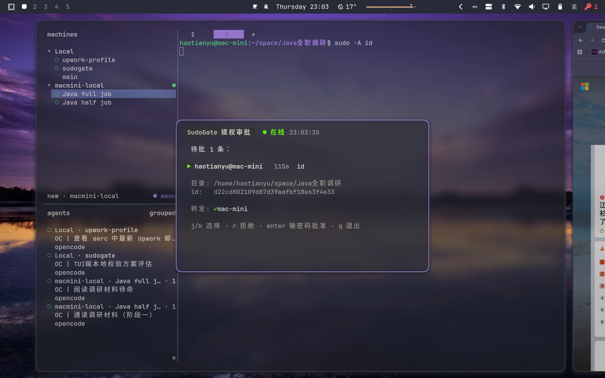
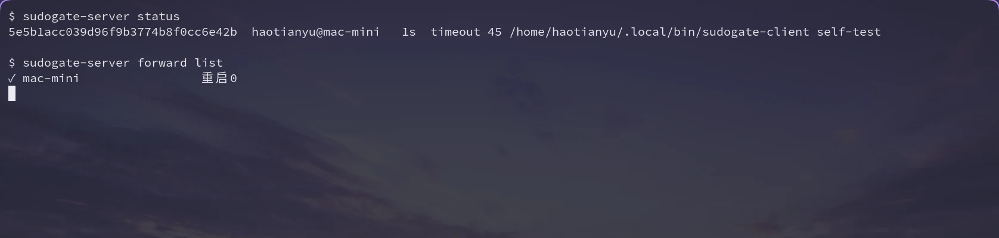
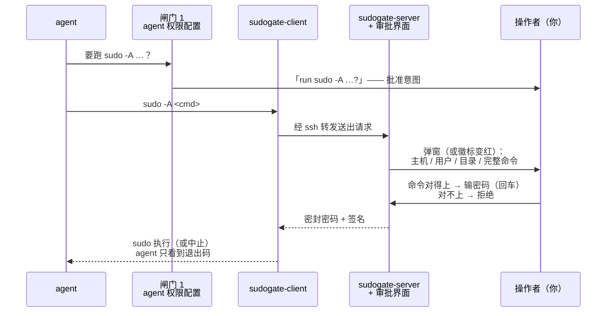
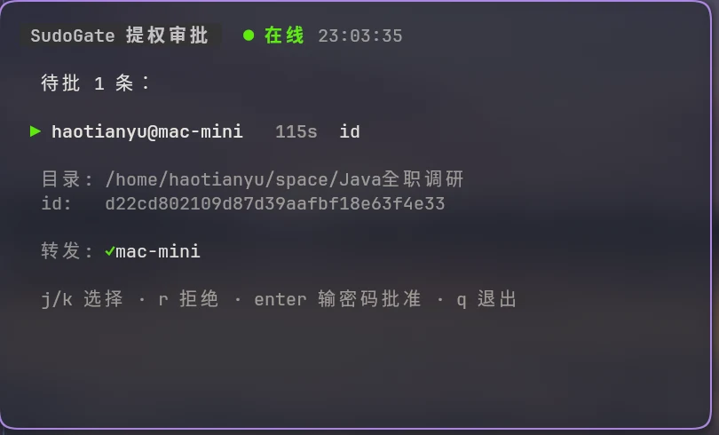
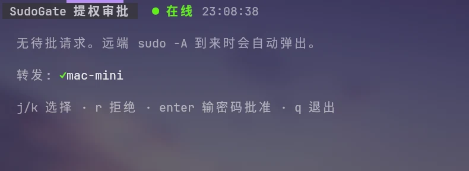
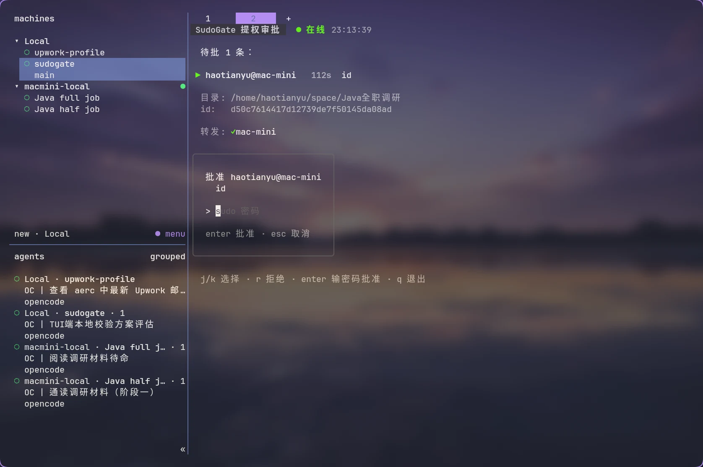
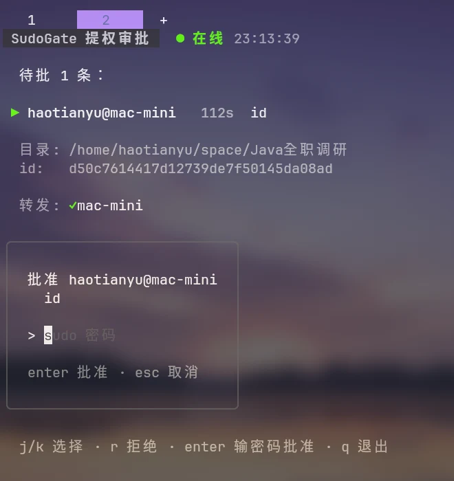
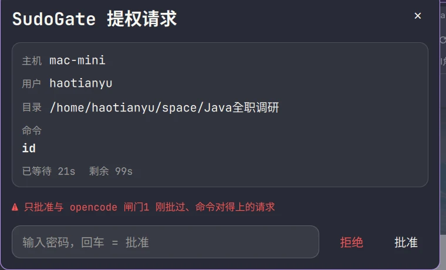
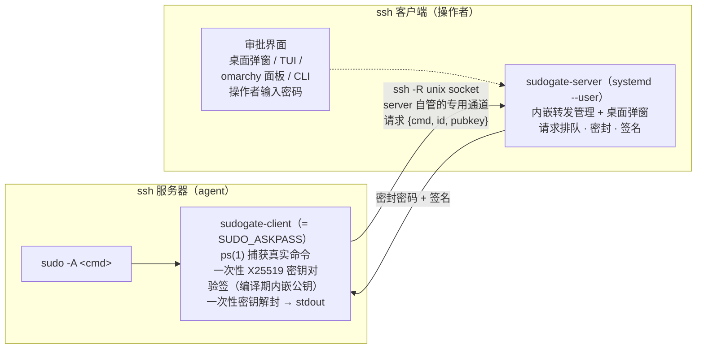

# SudoGate

**逆向 askpass** —— ssh 服务器上 AI agent 的 sudo 密码提示，送到你面前这台机器。

[English](README.md) · [简体中文](README.zh-CN.md)

## 为什么

在 ssh 服务器上跑编码 agent（opencode、Claude Code、codex……）迟早要用
`sudo`。常见方案都不好：

- **sudoers 配 `NOPASSWD`** —— agent 跑的每一段代码都握着 root
- **把密码粘进对话** —— 它进入模型上下文和会话记录
- **转发 GUI 对话框** —— 需要转发显示，无头机器上没用

SudoGate 走另一条路：agent 照常 `sudo -A`，密码提示经**专用 ssh 转发**送回
你的机器。每次提权都由人读过、批准；密码每次现场输入，两端都不落盘。

在操作者桌面上是什么样子——agent 在 ssh 服务器上跑了 `sudo -A id`，
这个窗口自己弹了出来：



## 特性

怎么用：

- **桌面弹窗** —— 请求到达自动弹出浮动窗口；队列清空（批准/拒绝/超时/
  撤回）窗口自行消失。一条命令开启：`sudogate-server popup on`
- **任意界面审批** —— 桌面弹窗、终端 TUI、omarchy 面板、裸 CLI；同属
  一个 server，先到先得
- **实时队列** —— 每请求倒计时、每主机转发健康灯、即时刷新
  （fsnotify，零轮询）；agent 侧 Ctrl+C 立即撤回自己的审阅
- **审计留痕** —— 每个决定（批准/拒绝/超时/撤销/停机）记 JSONL

安全模型：

- 人在环上，逐条命令 —— 每次提权一次审阅；拒绝即时终止
- 密码零持久化 —— 每次现场输入，两端静态存储为零
- 不新增信任面 —— 传输就是 ssh `-R` unix socket 转发；认证与加密由
  ssh 本身提供。不开端口、不发证书
- 编译期密钥分置 —— server 二进制内嵌私钥，client 二进制内嵌公钥；
  代码库没有密钥生成路径
- 构造性防篡改 —— 每请求 X25519 密封、Ed25519 签名、一次性 id 与
  命令哈希绑定
- 断连即拒绝 —— ssh 客户端机（server 所在机）关机或不可达时转发随之
  消亡，远端 `sudo -A` 直接失败
- 与 agent 自身闸门互补 —— 如 opencode 的 `"*sudo*": "ask"` 规则，
  每条命令获得两次独立批准

## 快速开始

三种角色：**构建机**（仓库 + 密钥，跑 `make`）、**ssh 客户端**（你的机器，
跑 sudogate-server 和审批界面）、**ssh 服务器**（agent 所在机，装
sudogate-client）。前两者通常是同一台。构建需要 Go ≥ 1.24、make、
openssl。下文 `<ssh-server>` 指 `user@host` 或 ssh config 里的别名。

**1. 密钥对，一次**（任意第三方工具；带外保存——仓库永不存密钥，每台
构建机需要同一对）：

```bash
mkdir -p keys
openssl genpkey -algorithm ed25519 -out keys/laptop.key
openssl pkey -in keys/laptop.key -pubout -out keys/laptop.pub
```

**2. ssh 客户端** —— server + 服务（+ 可选审批界面）：

```bash
make install-server    # 构建 + ~/.local/bin + systemd --user 服务
make install-plugin    # omarchy 审批面板（可选，推荐）
sudogate-server popup on   # 桌面弹窗（可选；见"审批界面"）
```

**3. 转发通道**，每台 ssh 服务器一次（目标须接受免密 BatchMode ssh）：

```bash
make install-forward HOST=<ssh-server>
# 远端 uid ≠ 1000？覆盖 socket 路径：
# make install-forward HOST=nuc:/run/user/1001/sudogate.sock
```

**4. ssh 服务器** —— 拷贝 client（静态 Go 二进制，零依赖；需传统版
sudo——sudo-rs 不支持 askpass）：

```bash
ssh <ssh-server> 'mkdir -p ~/.local/bin'
scp build/sudogate-client <ssh-server>:.local/bin/
echo 'export SUDO_ASKPASS=$HOME/.local/bin/sudogate-client' | ssh <ssh-server> 'cat >> ~/.profile'
```

<details>
<summary><b>备选路线</b> —— 在 ssh 服务器上构建 · agent（非交互）环境</summary>

```bash
# 服务器上构建路线：在 ssh 服务器 clone 仓库，把同一对密钥放进 keys/，
# 再 make（inject 需要私钥在场——私钥别带去多于必要的机器）
make install-client
```

`~/.profile` 的导出只覆盖交互 shell。agent 的 shell 是非交互的，**不读
任何 rc 文件**——要让变量进入 agent 进程环境，见
[与 agent 协作](#与-agent-协作)。

</details>

**5. ssh 服务器上的一次性 sshd 配置（root）**：连接结束（包括干净退出）
后 sshd 会留下 socket 文件，残文件会挡住转发重建。让每个新连接在绑定
前先 unlink 它——server 的内嵌转发靠它可靠自愈：

```bash
echo 'StreamLocalBindUnlink yes' | sudo tee /etc/ssh/sshd_config.d/99-sudogate.conf
sudo systemctl restart ssh    # Debian/Ubuntu；其他发行版可能叫 sshd
```

**6. 端到端验证**，在 ssh 服务器上：

```bash
sudogate-client test   # ssh 客户端弹出一条审阅请求
sudo -A <command>      # 真实使用
```



<details>
<summary><b>转发通道如何工作</b> —— 以及为什么 <code>~/.ssh/config</code> 必须干净</summary>

转发由 **server 内部管理**（`~/.config/sudogate/forward.conf`，每行一台
主机）：每个目标是一条受监管的 `ssh -N -R` 子进程——与你有没有交互会话
无关地常活、失败按退避重启、随 server 退出被收割。随时检查：

```bash
sudogate-server forward list     # 每主机 ✓/✗、重启数、最近错误
```

**不要**在 `~/.ssh/config` 里给目标主机配 `RemoteForward`。任何命中该块
的短命 ssh（工作区工具的健康探测、一次性 `ssh host 'cmd'`、自动重连的
挂载）都会抢走 socket 路径、几秒后死掉留下尸体文件，远端 `sudo -A`
表现为持续的 `connection refused`——而 server 的转发监听其实好端端地在
旁边"无名"活着。配了 `StreamLocalBindUnlink yes` 后每次命中连接都会无
条件发生——完整机理见
[当 ssh 由 herdr 这类工具代发时](#当-ssh-由-herdr-这类工具代发时)。

</details>

## 端到端示例（laptop → minipc）

用真名字：`laptop` 兼任构建机和 ssh 客户端；`minipc` 是 ssh 服务器
（IP 192.168.1.50，uid 1000）。从零到第一条提示：

```bash
# laptop：生成密钥对、make install-server（见上），然后送 client
ssh minipc 'mkdir -p ~/.local/bin'
scp build/sudogate-client minipc:.local/bin/
```

```bash
# minipc：导出 askpass（交互 shell）
echo 'export SUDO_ASKPASS=$HOME/.local/bin/sudogate-client' >> ~/.profile
```

```bash
# minipc（root，一次）：让新会话清理残 socket
echo 'StreamLocalBindUnlink yes' | sudo tee /etc/ssh/sshd_config.d/99-sudogate.conf
sudo systemctl restart ssh
```

```bash
# laptop：向 server 添加转发目标（热生效；免密 ssh 须已可用）
make install-forward HOST=minipc
```

接通后，在 minipc 的会话里：

```bash
sudogate-client test    # 自检：laptop 上弹出一条“sudogate-client self-test”
                        # 审阅——桥通了
sudo -A whoami          # 真实使用：读命令 → 输密码 → root
```

## 与 agent 协作

SudoGate 是**第二道**闸门。第一道在你 agent 自己的权限配置里；两道合起
来，每次提权获得两次独立的人工批准。

**闸门 1 —— agent 跑 sudo 前先问你。** opencode 的配法：

```jsonc
// ~/.config/opencode/opencode.json
{
  "permission": {
    "bash": {
      "*sudo*": "ask"
    }
  }
}
```

Claude Code 和 codex 有等价物；任何能对 `sudo` 命令要求人工确认的东西
都算闸门 1。

**闸门 2 —— 密码动身前 SudoGate 问你。** 完整流程：



让钓鱼变难的审阅纪律：**只批准命令与闸门 1 刚批内容一致的请求**。你没
批准过的命令、你没有会话的主机——拒绝。

**接通 agent 环境。** `sudo` 从自己的环境读 `SUDO_ASKPASS`，继承自 agent
进程。agent 的 shell 是非交互的：**不读任何 rc 文件**，快速开始里
`~/.profile` 的导出只覆盖交互会话。变量必须进入 agent 进程环境：

- agent 从交互 shell 启动——它继承那个 shell 的环境。把导出放在
  `~/.bashrc` 的交互判断**之前**（zsh 用 `~/.zshenv`），让每个子进程
  都拿到：

  ```bash
  # ~/.bashrc 第一行——在 "case $- in *i*)" 判断之前
  export SUDO_ASKPASS=$HOME/.local/bin/sudogate-client
  ```

- agent 由 systemd（或任何监管器）启动——写进 unit：

  ```ini
  [Service]
  Environment=SUDO_ASKPASS=%h/.local/bin/sudogate-client
  ```

从 agent 自己的 shell 工具验证：

```bash
echo "${SUDO_ASKPASS:-MISSING}"
```

**agent 看到什么** —— `sudo -A` 阻塞到有决定：

| 操作者动作            | agent 看到                            |
|----------------------|---------------------------------------|
| 输入密码              | 命令以 root 运行，正常退出             |
| 拒绝                 | exit 1，stderr 带 askpass 错误         |
| 超时（默认 120s）     | exit 1，stderr 带 timeout 错误         |

等待 = 有个人正在读你的命令——agent 应把阻塞当作正常现象，不要对未决
请求重试轰炸。agent 被中断（Ctrl+C）时未决审阅立即消失；相同的并发命令
各自独立审阅，逐条批准。

## 当 ssh 由 herdr 这类工具代发时

herdr、VS Code Remote 这类工具连远程时往往自己起 ssh、用自己生成的
配置，你的 `~/.ssh/config` 它们不读。**在内嵌转发管理的架构下这已经
不重要**：转发是 sudogate-server 自己的专用 `ssh -N -R` 子进程，与任何
工具的连接（以及你有没有开交互会话）完全解耦。工具的 ssh 怎么连、
断不断，桥都在。

历史上（v1 架构）转发靠 `~/.ssh/config` 的 `RemoteForward` 搭在"你已
开的 ssh 会话"上，于是有过一整套让 herdr 读用户 config、别名与 IP
同块匹配的配法——**那套配法现在是事故根源，请全部废弃**：herdr 对
机器做健康探测时每几秒拉起一条短命 ssh，只要命中任何带
`RemoteForward` 的 Host 块，就会在 `StreamLocalBindUnlink yes` 的 sshd
上反复抢走转发 socket 的文件名、随后死去留下尸体文件，远程 `sudo -A`
表现为持续的 `connection refused`，而 server 的转发监听被挤成"无名"
状态（`forward list` 看着还是 ✓）。迁移到内嵌转发后，请把
`~/.ssh/config` 里所有 sudogate 相关的 `RemoteForward` 行删掉。

## 审批界面

所有界面经同一个 ctl socket 与 server 对话；决定先到先得——一个界面
批准了，其余界面在下次 state 刷新时看到条目消失。

### 桌面弹窗

server 内置桌面弹窗：请求到达且队列非空且弹窗未开时，自动弹出一个
居中浮动的终端窗口跑 `sudogate-tui`。队列清空（批完/拒完/超时/申请人
撤回）后 TUI 自动退出、窗口随之消失。弹窗不会被 server 停止/重启的
信号强杀（独立会话 + 服务单元里的 `KillMode=process`）；窗口总是经
TUI 自身优雅关闭。q 关窗 = 弃管本批（交给超时兜底），之后**只有新
请求**会重新弹（其他界面的活动不会触发重弹）。

上文弹窗的特写——每请求倒计时、工作目录、请求 id、转发健康灯与键盘
流程（`j/k` 选择、`r` 拒绝、`enter` 输密码）：



开启与关闭：

```bash
sudogate-server popup on      # 生成默认 kitty 模板并启用
sudogate-server popup status  # 查看状态 / 模板 / 弹窗
sudogate-server popup off     # 关闭
```

**配置即终端。** 开关只是一个文件：`~/.config/sudogate/popup.conf`
（存在即启用；每次触发时重读，**编辑即时生效**）。内容是弹窗命令
模板——`{tui}` 占位符（必须独立成词）被替换为
`sudogate-tui --until-empty`：

```bash
kitty --app-id sudogate-approve --override initial_window_width=90c --override initial_window_height=26c --override remember_window_size=no -e {tui}
```

换终端改一行即可（更多模板见 `packaging/popup.conf.example`）：
`foot --app-id sudogate-approve -e {tui}`、
`alacritty --class sudogate-approve -e {tui}`……server 对终端零知识。

**浮动窗口规则（Hyprland）。** 新窗口默认平铺；要弹框观感需按窗口
class 配浮动居中规则。omarchy 的 lua 配置（`~/.config/hypr/`）写法：

```lua
o.window({ class = "^sudogate-approve$" }, { float = true, size = "800 480", center = true })
```

其他 WM/DE 用各自的窗口规则语法按同样的 class/app-id 匹配；不配规则
也能用，只是窗口平铺进布局。注意：server 以 systemd user service 运行
时从会话继承 `WAYLAND_DISPLAY`；无图形环境的机器上开启无效（spawn
失败仅记日志）。

### 终端 TUI

`make install-tui` 安装 `sudogate-tui`——弹窗里跑的那个键盘审批面板。
也可随时手动运行（`sudogate-tui`）；它用 fsnotify 盯 server 的 state
文件（零轮询），显示每请求倒计时与每主机转发健康灯，无需重连：server
下线时 TUI 会说明，回来时自动跟上。

空闲——面板活着、转发健康、无待批：



批准中——在请求上按 `enter` 弹出遮蔽密码框（再按回车 = 批准，Esc =
取消）；批准把密码密封给这条确切的请求：





### omarchy 面板

`make install-plugin` 安装 quickshell 面板：bar 上一枚钥匙徽标（🔑 +
待批数）——有请求等待时亮红，空闲时暗灰（钥匙 + 0）。点击展开审阅卡：



面板选项——在 `~/.config/omarchy/shell.json` 的布局条目上内联设置，
改动立即生效（无需重启 shell）：

```jsonc
{ "id": "tomaswade.sudogate", "hideWhenEmpty": true, "timeoutSec": 120 }
```

| 选项 | 默认 | 含义 |
|---|---|---|
| `hideWhenEmpty` | `false` | `false`：徽标常显（空闲时暗灰钥匙 + 0）；`true`：队列空时隐藏徽标 |
| `timeoutSec` | `120` | 驱动倒计时的请求期限；与 server 的 `-timeout` 保持一致 |
| `runtimeDir` | `""` | 存放 `sudogate.sock.ctl` / `sudogate.state` 的目录；空 = `XDG_RUNTIME_DIR` |
| `serverBin` | `""` | 批准/拒绝用的 `sudogate-server` 路径；空 = 自动探测（先 `~/.local/bin`） |
| `demo` | `false` | 渲染 canned 请求（无需 server）预览外观 |

### CLI

任何环境，零 UI 依赖：

```bash
sudogate-server status   # 列出待批请求
sudogate-server review   # 审阅最旧一条：显示命令、隐藏式密码输入；
                         #   密码 + 回车 = 批准，空回车 = 拒绝
```

## 架构



- **组件** —— `sudogate-server`（ssh 客户端）：监听从各 ssh 服务器转发来
  的 unix socket、排队请求、密封并签名响应；**内嵌转发管理**（每目标一条
  受监管的 `ssh -N -R` 子进程，退避重启，随 server 生命周期，持久化于
  `forward.conf`）；**内嵌桌面弹窗**（模板驱动的终端 spawn，配置即终端，
  server 对终端零知识）；以 systemd --user 服务运行；内嵌私钥。
  `sudogate-client`（ssh 服务器）：askpass 助手；除编译期内嵌公钥外一无
  所有，随每次 sudo 按需运行，可拷贝到任意多台主机。`sudogate-tui`
  （ssh 客户端）：终端审批面板（`make build` 构建），fsnotify 盯 state
  文件，含每主机转发健康灯；`--until-empty` 在队列清空后退出（弹窗
  模式）。`plugin/`（ssh 客户端）：omarchy quickshell 审批面板——
  inotify 盯 server 的 state 文件（零轮询），经 server 控制子命令
  批准/拒绝，密码经 stdin 传递。
- **信任与密码学** —— 传输层认证/加密继承自 ssh；响应来源由 Ed25519
  对 `id ‖ SHA256(cmd) ‖ SHA256(pubkey)` 的签名证明（对编译期内嵌公钥
  验签）；密码以 XChaCha20-Poly1305 在 X25519/HKDF 密钥下密封，只有
  等待中的 askpass 进程能打开。
- **已知边界** —— ssh 服务器上的同 uid 代码能提交自己的请求（钓鱼类；
  防御就是读命令，与本地桌面提示相同）。同 uid DoS 不可避免。ssh 客户端
  机失守即全盘皆输（私钥在它手上）。

## 行为（实测）

| 你的动作             | 对话框            | 结果                            |
|----------------------|-------------------|---------------------------------|
| 密码正确             | 1 次              | 命令以 root 运行                 |
| 密码错误             | 最多 3 次（重试） | sudo 放弃                       |
| 拒绝                 | 仅 1 次           | 立即中止                        |
| 空输入               | 仅 1 次           | 视为拒绝                        |

并发请求各自独立密封与决断；相同的并发命令各自独立审阅（逐条人工批准
的节奏天然串行化 apt/dpkg 这类锁竞争的执行）。client 断连（Ctrl+C）
立即撤销自己那条审阅。

## 排障

- **`sudo: no askpass program specified`** —— `SUDO_ASKPASS` 没到达
  sudo 进程。agent 的 shell 非交互、不读 rc 文件；环境链见
  [与 agent 协作](#与-agent-协作)。
- **`remote port forwarding failed for listen path …`** —— 出现在
  `sudogate-server forward list` 的 ✗ 详情里。通常是 ssh 服务器的 sshd
  默认 `StreamLocalBindUnlink no`：socket 文件在连接拆除后残留（**干净
  退出也会**）挡住转发重建。先清掉：

  ```bash
  ssh -o ClearAllForwardings=yes <ssh-server> 'rm -f /run/user/1000/sudogate.sock'
  ```

  永久修法见快速开始里的 `StreamLocalBindUnlink yes`。

- **`sudo -A` 持续 `connection refused` 而 `forward list` 全 ✓** ——
  几乎可以断定是 `~/.ssh/config` 里残留的 sudogate `RemoteForward`：
  某工具的短命连接（herdr 健康探测、自动重连的挂载）命中该块，在
  `StreamLocalBindUnlink yes` 的 sshd 上反复抢走转发 socket 的文件名后
  死掉，留下远端读作 refused 的尸体。删掉 `RemoteForward` 行，让内嵌
  转发独占 socket（见
  [当 ssh 由 herdr 这类工具代发时](#当-ssh-由-herdr-这类工具代发时)）。

- **人不在时 `sudo -A` 失败** —— 只有 server 本身停了才会（内嵌转发随
  server 活，不随你的会话活）；查 `systemctl --user status sudogate`。
- **sudo-rs** —— 完全不支持 askpass；用传统版 sudo（sudo.ws 的 `sudo`）。
- **`sudo -n true` 仍要密码** —— 正确：SudoGate 刻意不提供任何免密路
  径。sudoers 里没有需要配的东西。

## 参考

- [lllamnyp/askpass](https://github.com/lllamnyp/askpass) —— 同模式，走 mTLS
- [OzoneAsai/remote-askpass](https://github.com/OzoneAsai/remote-askpass) —— Windows agent 变体
- [crypdick/sudoplz](https://github.com/crypdick/sudoplz) —— SSH 密钥加密存储的 askpass
- [0xMH/sudo-mcp](https://github.com/0xMH/sudo-mcp) —— 弹本地系统对话框的 MCP 工具（agent 与人同机）
- [hughesjs/sudo-mcp](https://github.com/hughesjs/sudo-mcp) —— MCP + polkit/pkexec（需本地桌面会话）

## 许可证

[MIT](LICENSE) —— Copyright (c) 2026 tomasWade
